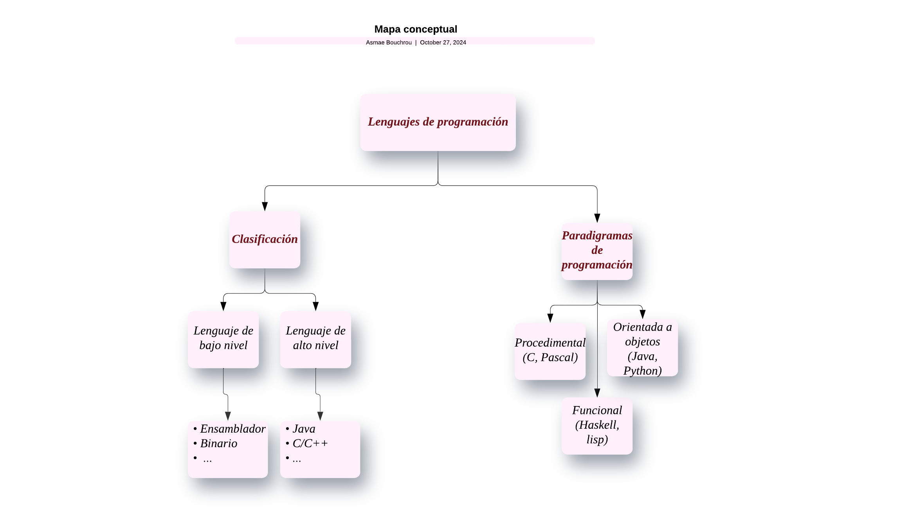

# CICLO FORMATIVO DE GRADO SUPERIOR DESARROLLO DE APLICACIONES MULTIPLATAFORMA

## Módulo: Entornos de Desarrollo

> 

### Año Escolar 2024/2025
### ASMAE BOUCHROU

# Conceptos de Software

## Software

###  1. Definicón de Software

El **software** es el conjunto de programas y aplicaciones que permiten al hardware realizar tareas específicas. Funciona como instrucciones digitales que controlan el funcionamiento de los dispositivos electrónicos.

### 2. Tipos de software según su función

El software se clasifica en:

- **Software de sistema**: Incluye sistemas operativos y controladores.
- **Software de aplicación**: Realiza tareas específicas como editores de texto y navegadores.

- **Software de programación**: Herramientas para programadores, como IDEs y compiladores.

- **Software malicioso (Malware)**: Programas dañinos como virus y troyanos.

###  3. Relación entre software y hardware

El software y el hardware trabajan juntos para permitir el funcionamiento de los dispositivos.

- **Desde el sistema operativo (SO)**: El SO gestiona el hardware y es intermediario entre este y las aplicaciones.

- **Desde las aplicaciones**: Las aplicaciones usan los recursos del sistema mediante el SO.

### 4. ¿Qué es el desarrollo del software?

El **desarrollo de software** es el proceso de creación y mantenimiento de aplicaciones, organizado en varias fases guiadas por un modelo de ciclo de vida.

##  Modelos de ciclo de vida del software

Modelos de ciclo de vida del software

###  1. ¿Qué es el modelo de ciclo de vida?

Un **modelo de ciclo de vida** define los pasos necesarios en el desarrollo del software, desde la planificación hasta el mantenimiento.

### 2. Tipos de modelos de ciclo de vida

- **Modelo en Cascada**: Lineal, útil en proyectos con requisitos estables.

- **Modelo Iterativo**: Repite fases en ciclos para mejorar el producto.

- **Modelo Ágil**: Fomenta colaboración y flexibilidad, con entregas rápidas de versiones funcionales.

## Herramientas CASE - Clasificación

Las **herramientas CASE** (Computer-Aided Software Engineering) se dividen en:

- **CASE de Alto Nivel**: Para análisis y diseño.
- **CASE de Bajo Nivel**: Para codificación y prueba.
- **CASE Integradas**: Cubren todo el ciclo de vida.

##  Mapa conceptual sobre los lenguajes de programación

> 

## Fases en el desarrollo y ejecución del software

1. **Análisis de Requisitos**: Definir qué necesita el usuario.
2. **Diseño**: Planificar la estructura y componentes del software.
3. **Codificación**: Escribir el código.
4. **Pruebas**: Validar que cumple los requisitos.
5. **Implementación**: Hacer que esté disponible para uso.
6. **Mantenimiento**: Mejoras y correcciones continuas.

---
